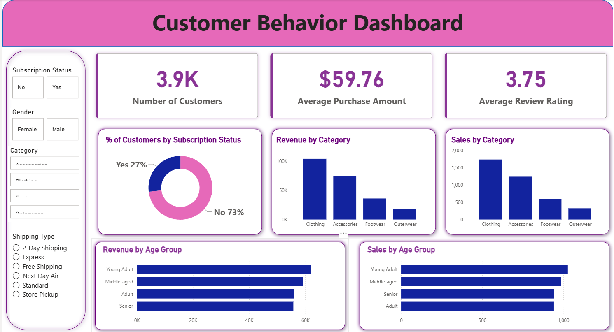

## Customer Shopping Behavior Dashboard (Power BI)

An interactive Power BI dashboard analyzing customer shopping behavior, demographics, and purchasing patterns across product categories, seasons, and payment methods.

## 📊 Project Overview

This project explores customer-level transaction data to answer key business questions:
- Which age groups and genders spend the most, and on what categories?
- How do discounts and subscriptions affect purchase frequency?
- Which payment methods and shipping types are most popular?
- How does purchase behavior vary by season and location?
- What's the relationship between review ratings and repeat purchases?

## 🗂️ Dataset

`data/customer_shopping_behavior.csv` — ~3,900 customer transaction records with the following fields:

| Field | Description |
|---|---|
| customer_id, age, gender, age_group | Customer demographics |
| item_purchased, category, size, color | Product details |
| purchase_amount, discount_applied | Transaction value and discounting |
| location, season | Geographic and seasonal context |
| review_rating, previous_purchases, purchase_frequency_days | Customer engagement history |
| subscription_status, payment_method, shipping_type | Purchase behavior and preferences |
| frequency_of_purchases | Purchase cadence (e.g. Weekly, Fortnightly) |

## 🛠️ Tools Used

- **Power BI Desktop** — data modeling, DAX measures, interactive report pages
- **Power Query** — data cleaning and transformation
- **DAX** — calculated measures (e.g., Average Purchase Value, Repeat Purchase Rate, Discount Uptake %)

## 📈 Dashboard Highlights

- KPI cards for Total Revenue, Average Purchase Amount, and Average Review Rating
- Demographic breakdown by age group and gender
- Category and seasonal purchase trend analysis
- Payment method and shipping type preference comparison
- Subscription vs. non-subscription spending behavior
- Interactive slicers for filtering by category, season, and location

## 🔑 Key Insights

- Clothing is the dominant category by volume (~44% of all transactions), though average spend per transaction is broadly similar across categories (~$57–60)
- Discount usage does not correlate with higher spend — non-discounted purchases actually average slightly higher ($60.13 vs $59.28), suggesting discounts may drive purchase frequency rather than basket size
- Subscribed customers show marginally higher repeat-purchase counts (26.1 vs 25.1 previous purchases) than non-subscribers, but subscription status has little effect on the amount spent per transaction
- Payment method and shipping preference are evenly distributed across options, with no single channel dominating customer choice
- Review ratings show no meaningful correlation with purchase amount or purchase history, indicating customer satisfaction is largely independent of spend behavior in this dataset

## 📂 How to View

1. Download `dashboard/customer_behavior_dashboard.pbix`
2. Open in [Power BI Desktop](https://powerbi.microsoft.com/desktop/) (free)
3. Explore interactively using the slicers and filters on each report page

## 📬 Connect

[LinkedIn](https://www.linkedin.com/in/pijush-paul-4a6764197)
